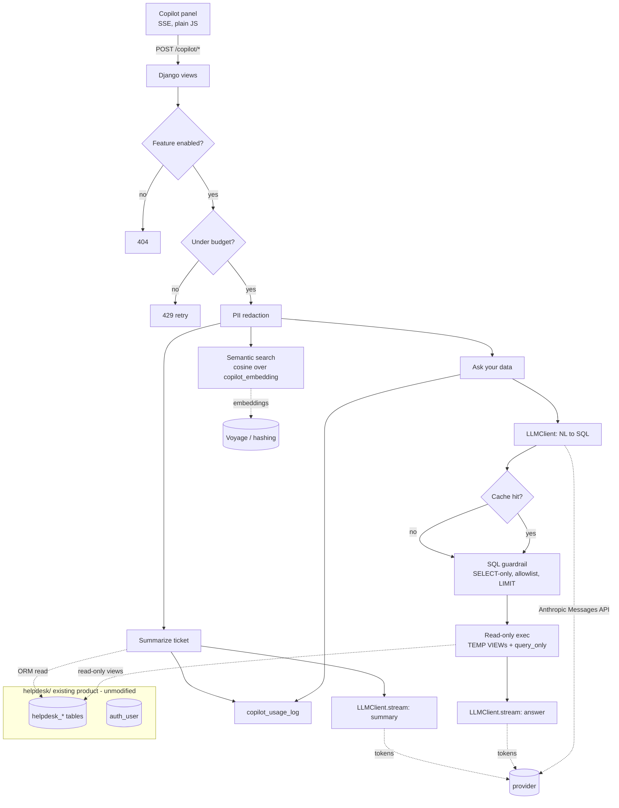

# ai-retrofit-django

[](https://github.com/amin-ale/ai-retrofit-django/actions/workflows/ci.yml)
[](LICENSE)
[](pyproject.toml)
[](pyproject.toml)

**An AI copilot retrofitted into an existing multi-tenant Django SaaS without touching its schema or auth.** It's built for the request I hear most: "add AI features to my SaaS product" without breaking what already works. The host app (`helpdesk/`) is a real, runnable helpdesk product: tenants, customers, tickets, messages, and the standard Django auth table, standing in for "your existing product." The copilot (`copilot/`) drops in beside it and adds three features support agents actually ask for: semantic search over their own tickets, "ask your data" in plain English with a SQL guardrail, and one-click ticket summarization. All three sit behind a per-tenant feature flag, a per-tenant cost cap, PII redaction, prompt/response logging, and an eval set wired into CI. It adds only `copilot_`-prefixed tables, its migration doesn't even depend on the host's, and every test runs offline against recorded provider responses. No API key required. This is the retrofit a greenfield AI shop can't demo: the hard parts are backward compatibility, the existing tenant boundary, and cost control on someone else's production database.

The companion write-up, [docs/RETROFIT-CONSTRAINTS.md](docs/RETROFIT-CONSTRAINTS.md), walks each constraint and how the code answers it. It has a smaller sibling in a second stack: `ai-retrofit-laravel` (one AI feature, Laravel + Vue).

## What the retrofit adds

| Concern | How it is handled | Where |
| --- | --- | --- |
| **Semantic search** | Ticket text is embedded per tenant; queries are ranked by cosine similarity, tenant-scoped | `services/semantic_search.py`, `copilot_embedding` |
| **Ask your data** | NL → SQL via the model, then guardrail + read-only tenant-scoped execution | `services/ask_data.py` |
| **SQL guardrail** | SELECT-only, table allowlist, no DDL/DML/comments/UNION, mandatory LIMIT | `services/sql_guard.py` |
| **Read-only, tenant-scoped exec** | `TEMP VIEW`s filtered by server-side `tenant_id` + `PRAGMA query_only` | `services/sql_executor.py` |
| **Summarization** | Ticket thread → concise agent summary, streamed | `services/summarize.py` |
| **Streaming UI** | SSE endpoints; a plain-JS panel renders SQL, rows, and streamed tokens | `views.py`, `templates/copilot/panel.html` |
| **Feature flag** | Global kill-switch + per-tenant enable; disabled → `404` | `services/flags.py` |
| **Per-tenant cost cap** | Daily token budget; over budget → `429`; identical requests served from cache | `services/budget.py`, `services/cache.py` |
| **PII redaction** | Emails/cards/SSNs/phones stripped before any LLM call and before summarizing rows | `services/redaction.py` |
| **Prompt/response logging** | Every call logged with model, token counts, cache flag | `services/usage.py`, `copilot_usage_log` |
| **Vendor-lock hedge** | Model and embeddings sit behind `LLMClient` / `EmbeddingClient` interfaces | `llm/` |
| **Eval regression gate** | Fixture questions assert SQL shape, guardrail rejection, and PII redaction in CI | `tests/test_eval_gate.py` |
| **Zero schema breakage** | Only `copilot_` tables added; migration has no host dependency; enforced by tests | `tests/test_migration_safety.py`, [docs/MIGRATION-PLAN.md](docs/MIGRATION-PLAN.md) |

## Architecture



The host app's tables and auth are never modified. Ask-your-data reads through tenant-scoped
temporary views on a `query_only` connection; summarization reads tickets through the ORM
filtered by the caller's tenant. The whole copilot is four additive `copilot_` tables.

## Offline by default

The copilot ships with two zero-dependency backends so the entire thing runs, and every test
passes, without an API key or network:

- **`LLM_BACKEND=fake`** (default) replays recorded provider responses from
  `copilot/llm/recorded_demo.json`: the same fixtures the eval gate asserts against.
- **`EMBEDDING_BACKEND=hashing`** (default) is a deterministic hashing embedder, good enough for
  a working demo.

For production, set `COPILOT_LLM_BACKEND=anthropic` (Anthropic Messages API, via the
`AnthropicLLMClient`) and `COPILOT_EMBEDDING_BACKEND=voyage`, and supply the client's own keys.
The provider calls sit behind interfaces in `copilot/llm/`, so nothing else changes.

## Quickstart

Requires Python 3.11+ and [uv](https://docs.astral.sh/uv/). Node is only needed to syntax-check
the panel JS.

```bash
uv venv
uv pip install -e ".[dev]"

python manage.py migrate
python manage.py seed_demo               # demo tenants, tickets, messages
python manage.py copilot_seed_embeddings # build the semantic-search index

python manage.py runserver               # visit http://localhost:8000/copilot/
```

The panel takes a tenant id (the seed prints them: `acme` → 1, `globex` → 2). Try
"How many open tickets are there?", then try "drop the users table" to watch the guardrail
reject it. To use a real model, export the client's key and switch backends:

```bash
export ANTHROPIC_API_KEY=sk-ant-...
export COPILOT_LLM_BACKEND=anthropic
```

No key is ever committed; the client deploys with their own.

## Running the tests

```bash
pytest -q
```

61 tests, all offline, run in well under a minute. Coverage:

- `test_sql_guard.py` covers the SQL guardrail: allow/limit-injection/clamp, plus a dozen rejected attack strings.
- `test_sql_executor.py` checks the read-only executor: tenant scoping, view joins, an engine-level write block, and pragma restoration.
- Ask-your-data (`test_ask_data.py`) exercises the full path: SQL, rows, answer, dual logging, SQL-gen caching, and rejection of destructive or exfiltration attempts.
- `test_semantic_search.py` and `test_summarize.py` cover relevance, tenant isolation, top-k ranking, summary output, cache hits, and cross-tenant rejection.
- Budget and flags (`test_budget.py`, `test_flags.py`) verify zero-budget blocking, exhaustion after use, per-tenant budget isolation, per-tenant flag overrides, default-on behavior, and the global kill-switch.
- `test_endpoints.py` hits the HTTP layer directly: SSE streaming, guardrail `400`, budget `429`, disabled `404`, and validation errors.
- The eval gate (`test_eval_gate.py`) is data-driven from `tests/fixtures/eval_cases.json`.
- `test_migration_safety.py` makes sure copilot migrations never touch host tables.
- Redaction (`test_redaction.py`) covers email, card, SSN, and phone patterns.

CI (`.github/workflows/ci.yml`) runs the suite on Python 3.11/3.12/3.13, then exercises the full
offline demo path (migrate → seed → index → generate the cost table → cost report) and
syntax-checks the panel JS.

## Cost model

Every call is logged with its token counts; `copilot_cost_report` turns the log into reproducible
dollars:

```bash
python manage.py copilot_cost_report          # table
python manage.py copilot_cost_report --json   # machine-readable
```

The before/after-caching comparison in [docs/COST-TABLE.md](docs/COST-TABLE.md) is **generated**,
not hand-written:

```bash
python scripts/generate_cost_table.py
```

It runs the ask-your-data pipeline against the recorded fixtures with the cache cold, then warm,
and computes cost per 1k requests at the configured list prices. On the committed repeat-heavy
workload the response cache cuts cost per 1k by ~99%; the real reduction scales with your
traffic's repeat rate. These are recorded-fixture figures. Run the same command with the
Anthropic backend against real questions for measured production numbers.

## Legal / safety notes

- Point-in-time engineering reference, provided "as is" (see `LICENSE`); not a security audit and
  no guarantee about any particular deployment.
- The client deploys with their own provider keys. No key is committed; the test suite never
  contacts a live API.
- PII redaction is conservative pattern matching before every model call, not a compliance
  guarantee. Review it against your own data-handling requirements before production use.
- Ask-your-data executes only guardrail-validated `SELECT`s through tenant-scoped read-only views;
  the demo executor toggles `PRAGMA query_only` on the shared connection, while production should
  use a dedicated read-only database role (see [docs/RETROFIT-CONSTRAINTS.md](docs/RETROFIT-CONSTRAINTS.md)).

## Hire me

I retrofit AI features into existing, money-critical codebases without breaking what already
works: backward-compatible migrations, the existing auth boundary respected, cost and quality
under control. Need AI added to your Django, FastAPI, or other production app the safe way?
[https://amin-ale.github.io/portfolio-site](https://amin-ale.github.io/portfolio-site) · [amin.ale.business@gmail.com](mailto:amin.ale.business@gmail.com)
